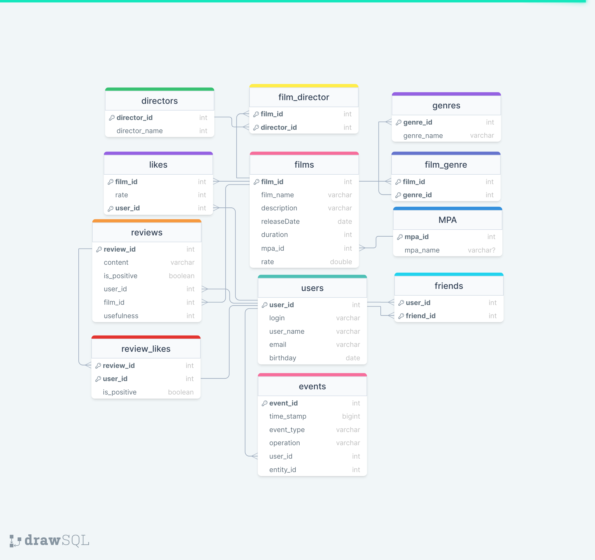

# java-filmorate

## Список задач, выполненных группой №13 в рамках 12-го спринта.
1. ! Удаление фильмов и пользователей (Андрей Зараев)
2. ! Добавление режиссёров в фильмы (Евгений Варлахов)
3. \+ Функциональность  «Отзывы» (Илья Закотенко)
4. \+ Функциональность «Лента событий» (Екатерина Балакирева)
5. Вывод самых популярных фильмов по жанру и годам (Дмитрий Печагин)
6. Функциональность «Общие фильмы» (Екатерина Балакирева)
7. Функциональность «Поиск» (Дмитрий Печагин)
8. Функциональность «Рекомендации» (Андрей Зараев)

#  *** Рефакторинг: лайки → оценки 
## Изменения в структуре 

### Изменения в БД 
В таблице likes добавляется поле rate типа int.

### Изменения в модели
Добавляется класс Rate<userId, rate>  
Film.likes становится списком < Rate >  
В Film добавлено поле rate 

### Новые файлы
Добавлена папка postman с тестами всего функционала, включая add-mark 

## Эндпоинты для новых лайков:

PUT /films/{id}/like/{userId}?rate={rate}  
Добавляет/обновляет оценку фильма пользователем.

DELETE /films/{id}/like/{userId}  
Удаляет оценку фильма пользователем.
    
